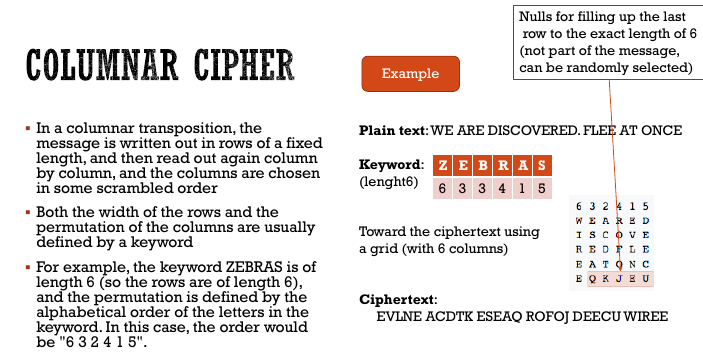

# i2ns

[TOC]

## 18/09/2019

### Security Properties

> These are **principles** of Security!

* **Confidentiality**: Prevent unauthorized disclosure of information
* **Integrity**: Prevent unauthorized modification of information
* **Avaliability**: Prevent unauthorized withholding of information of resources

A **qualitative graph:**

Security policies are a **set of rules**.

One security mechanism is a **sandbox**.

> A **sandbox** is an area which everything is controlled if inside. If the executable needs an access to something in particular (like a system call), it needs permissions.

> This is mostly used by **android echosystem.**

Another security mechanism it's **Encryption**

_Which one of the CIA Triad is more important to us?_

> These secuity mechanism are **principally SW.** A **SW** is full of bugs. Known or uknown bugs, they are a problem. There's a **risk** everytime, we need to have the **lowest risk possible.**

### AUTH

> **Authentication**: A Security Mechanism used to prevent unauthorized access to a system, verifying an user with **credentials**(userrname and password)

> **Knowledge Factor** in auth process: Something that should be kept **as a secret**, like **passwords**.

#### Auth Username-Password login

The auth system with USERNAME-PASSWORD works only if we can remember a PASSWORD.

This is a problem when the password is too easy.

##### The **knowledge factor**, in this case, should be a **complex** and **hard-to-remember** password.

Obviously, it's hard to remember this.

##### Guessing

One of the easiest way to `crack` a password is **guessing**.(using **dictionaries**, which are password-Lists)

One of the **main weakness** of the **human being** is not-remembering a difficult password.

##### Phishing

> **Phishing**: Creating a fake login attack, very similar or equal to a service.
> When the victim access to a phishing page, the password is sent to the attacker.

##### Same-Password

Another weakness is **using the same password for more services.** If one of them gets hacked, someone could use that hacked password to enter somewhere else.

##### Fix

A simple fix is using common-words combination instead of hard passwords.

#### AuthN: Bootstrapping

* Password Should be *secret between user and system.*
* A user can get password personally, but the communication could be intercepted.
  * A good fix is forcing the user to change the psw while trying to log in.
  * If he forgot the password, **don't send them 'plaintextly'**, send them an unique link with hours of validity. This link is used to change the password.

#### Storing Passwords

##### Hash Functions

We can store a password plaintext, but this is a **very bad practice.**

A good way to store password is to **store the HASH of the password** 

##### Hash: 1-way functions

* Cryptographic hash functions

* Two different hash can't collide so easily

* > A 1-way function $f$ is a function that is **relatively easy to compute but hard to reverse.**

  * Given an input $x$ and a 1-way function $f$, $f(x)=y$ . $y$ should follow the [Avalanche Effect](https://en.wikipedia.org/wiki/Avalanche_effect). $y$ is called **digest**.

* This function have a fixed output length.

* A hash function shoud be **cheap to execute.**

> There's a more secure way to do that. An attacker can try to use a **rainbow table**.

a **rainbow table** is a dictionary with a precomputed hash. We can try to search the hash there and check if it exists a `dehashed` password.

If the hash is used in more than one user, **we can access more users with the same password**. We know that it's the same password becouse it's the **same HASH**.

We can fix this with a HASH-SALTED password.

##### HASH SALTING

We can use a '**salt**' variable, which is a random string(generated with a good seed), for each new password stored.

We add this salt to the password.

for example 

---

$\text{hash}(pass)=\text{hash}(pass)$

while

$\text{hash}(pass+salt_1)\ne \text{hash}(pass+salt_2)$ 

obviously $salt_1\ne salt_2$

---

> **WARNING**: Even if this mitigate the problem of rainbow table, we need to use **STRONG** HASH functions.
>
> _Example:_ `MD5` digest is small and crackable, while `sha256` is stronger, like `BCRYPT`.

*Overtime the robustness of an algorithm is usually weakened by stronger and faster computers.*

*What's the current State-Of-The-Art?*

*Salt should generated with **security libraries** which generates **unpredictable sequencies**(or hard-to-predict sequencies).*

#### SINGLE-SIGN-ON (SSO)

> **SSO:** Auth process which allows you to log in with the same set of credential to multiple service provider (asking the Identity Provider, like *google SSO*)

How it works?

Well:

More precisely:

As we can see:

1. The service provider **doesn't care about auth**, it just redirect the login to the **Identity Provider**;
2. The **identity provider** check and reply to the Service provider if it's OK or NOT OK;
3. the **Service provider will let the user log in if it's successful**. If it's not, it will reject the user.

Problems:

1. We need to (usually) pay for this service;
2. It should be **frictionless**;
3. We need to trust the **Identity Provider** security mechanisms, if it gets hacked, all the services gets hacked.
4. If the **Identity Provider** goes offline, all the services can't log in.
5. If the comunication between the **SP** and the **IP** is interceptable, it's **very problematic.** We should have a strong **SSL/TLS** connection.

> The standard is **SAML 2.0**

In italy we have **SPID**, even if it's not **mobile-first** designed.

#### Assurance Levels

it's a Graph between **Relative Security Level** and **Solutions**.

1. Something you **know**(password) $\leftarrow$*worst*
2. Something you **have** + something you **know**(keycard+password)
3. Something you **have** + something you **are**(Keycard+ Biometric)
4. Something you **have** + Something you **know** + Something you **are**(Keycard+password+Biometric) $\leftarrow$*best*

> **Possession Factor**: When using something, it's required to set a **trusted device**. When you log in, (**knowledge factor**) you are asked to press a button in a device(*like phone push notification*) or gets a **1TP**(One time Password) randomly generated in your **trusted device**.

#### Contextual or behavioural auth

1. Checks *IP*(Is it the first time you log in from this location?)
2. Checks for *Cookies, geoloc*, ...

> Very effective.

## 25/09/2019

### Cryptography 

_Something about story(turing, rsa...)_

Some definitions:

* > **Cryptography**: Branch of mathematics, it's a science which studies the secret writing.
  > Crypto + graphy.

* > **Cryptanalysis**: science and study of methods of breaking cyphers.

* > **Cryptology**: Cryptography and cryptanalysis

Today definition:

> **Cryptography** is the study of the mathematical tecniques related to aspects of the information security, such as:
>
> * Confidentiality;
> * Data Integrity;
> * Entity Authentication;
> * Data Origin Authentication.

Cryptography help us to :

* **Securing comunications**:
  * If someone tries to intercept an encrypted comunication, he can't read the information passing through.
* **Keep integrity**:
  * If data were somehow altered we can't really decypher them.
* **Have confidentiality**:
  * If data are encrypted, an attacker can't read them.
* **Authenticate**:
  * Authenticating a message using asymmetric encryption

#### Cryptosystem

> **Cryptosystem**: A cryptosystem is a 5-tuple $(E,D,M,K,C)$ where
>
> * **E** is an ecryption algorithm;
> * **D** is a decryption algorithm;
> * **M** is the set of plaintexts;
> * **K** is the set of keys;
> * **C** is the ciphertexts.

E and D can be characterized as functions:

* $E: M\text{x}K\to C$
* $D: M\text{x}K\to M$

TL;DR : $D(E(n,k),k)=m$

> **Kerckhoffs' principle:** Do not rely on the secrecy to algorithms; the **key should be the only secret that needs protection**.

##### Keys

> A **key** is an input to a cryptographic algorithm used to obtain confidentiality, integrity, authenticity or other property over some data.

The security of a system depends on keeping the **key secret** to some parties.

* The **keyspace** is the set of all possible keys.
* **Entropy** is a measure of **variance in keys**, measured in bits.

Keys can be stored:

* In a secure place:
  * Passwords, disk keyrings,...
  * TPM, Secure co-processor, smartcard...
* Public:
  * Certificates

A secure cryptography uses:

* A strong random generator:

  * Based on a **seed**
  * $f(\text{seed})=\text{random}$
  * the function shouldn't repeat the `random` output(it should be unique).
  * The seed should be secure.

* The secret key should be **computationally-hard to break** (*to generate from the public key/message*) (from **public** $\to$ **private**)

* > **Brute-force approach** : trying every possible key until an intelligible translation ofthe ciphertext into plaintext is obtained
  >
  > * On average, half of all possible keys must be tried to achieve success

##### Keys distribution

We need to destribute a key without even if someone does **MITM Attack**

> **MITM ATTACK**: Man in the middle of the conversation, who can read everything through there.

We have two type of **cryptography**:

* Symmetric Encryption (One key to cypher, the same key to decypher)
* Asymmetric Encryption (One key to cypher, one different key to decypher)

> The security of the encryption is on the private key. If we lose the private key, we kill our security.

We shouldn't rely only on encryption.

$E(key,plaintext) = ciphertext$
$D(key,ciphertext) = plaintext$

#### Transformations

Two types:

* **Substitution**: each element in the plaintext is mapped into another element. (letter **replaced** bt other letters)
* **Transposition**: elements in the plaintext are rearranged.(**same** letters, different order)

> we can't lose information.

##### Substitution

> **A substitution cip
>
> her** is a method of encrypting by which units of plaintext are replaced with ciphertext, according to a **fixed** system.

*  The key is the substitution
* The "units" can be:
  * letters
  * words
  * phrases
  * ...
* The receiver gets the plaintext by **inverse substitution**

* Example:
* 

**Rot K**:

$e(x)=(x+k)(\mod 26)$

$d(x)=(x-k)(\mod26)$

This is not **secure**, we can easily **bruteforce** the caesar cypher.

We can also try to **guess the language of the message**, using **distribution of the letters**. In english:

* 'e' is 13% of the times present
* 'z' is the less frequent, 1% of the times.

##### Trasposition

* The key is the permutation of symbols.
* Example:
  * 

#### Modern encryption

Modern encryption tecniques:

* **Stream encryption**
* **Block encryption**
* **Public Key encryption**

Stream and block$\to$ Symmetric encryption

Public-key $\to$ Asymmetric encryption

##### Symmetric key Cryptography

$D( k, E( k, p ) ) = p$

> Key management determines **who can access data.**

Types:

* **Stream cyphers:** Encrypt short sequences of data under a changing key stream.

  * Security relies on key stream generator.
  * Encryption is simple.

* **Block cyphers**: Encrypt sequences of "long" data blocks without changing the key.

  * A block of plaintext is treated as a whole and used to produce a ciphertext block of equal length
  *  A block cipher breaks the message $(M)$ into successive blocks $M1, M2, M3,..., Mn$, and enciphers each Mi with the same key $k$

  Used in:

  * AES and DES

##### Asymmetric Key Cryptography

Two modes:

* **Public key** encrypt, **Private key** decrypt (Security)
  * We can relies on this encryption mode to have **integrity** of data:
    1. HASH the message;
    2. SIGN the hash with our public key;
    3. When the guy will receive our message, he will **decrypt the hash** with his **private key**
    4. Then he **HASH** the message and check if his hash is the same as the **decrypted hash**.
    5. If it's the same OK.
  * Encrypt: $e(m,k^B_P)=c$
  * Decrypt: $d(c,k^B_S)=m$

* **Public key** decrypt , **Private key** encrypt (Authentication)
  * Used by HTTPS Certificates, it authenticates the website and the connection to the website.
  * Encrypt: $e(m,k^B_S)=c$
  * Decrypt: $d(c,k^B_P)=m$

#### Differences

|          Symmetric          |                          Asymmetric                          |
| :-------------------------: | :----------------------------------------------------------: |
| Key distribution is harder. | Key distribution is not a problem, just send the public key. |
|           Faster            |                   Slower(RSA for example)                    |
|        Hard to crack        |                       Harder to crack                        |

TODO:

* Check if it's deprecated;
* Use strong cyphers. 